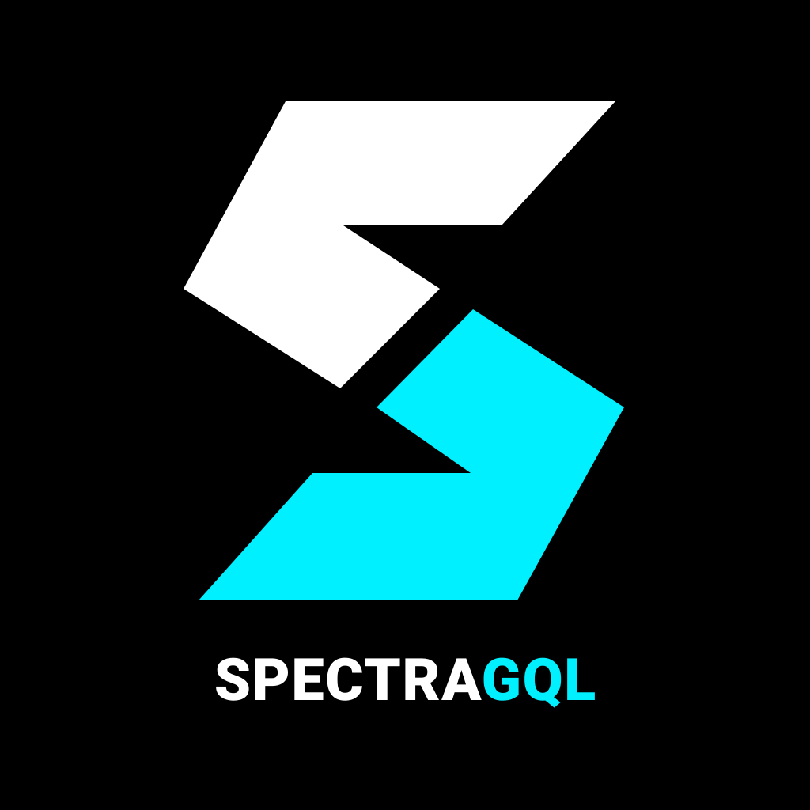

# SpectraGQL

<p align="center">
  
</p>

<p align="center">
  <strong>The Write-Path Gateway for GraphQL</strong><br>
  <em>Transforming GraphQL mutations into high-performance event streams at wire speed.</em>
</p>

<p align="center">
  <a href="LICENSE"></a>
  <a href="https://www.rust-lang.org/"></a>
  <a href="https://github.com/cloudflare/pingora"></a>
  <a href="https://spectragql.dev"></a>
  
</p>

---

## The Core Thesis

GraphQL gives frontend teams expressive control over data retrieval. However, in enterprise microservice architectures, its write path (**Mutations**) frequently devolves into an architectural liability:

- **The Synchronous Fan-Out Anti-Pattern:** A single mutation resolver often coordinates multiple downstream microservices or databases synchronously. If an intermediate step fails, state is left corrupted with no native rollback, distributed saga coordination, or audit trail.
- **Federation's Blind Spot:** Traditional gateways (Apollo Federation, Cosmo, Hive) focus almost exclusively on distributed query planning and schema composition. They treat mutations as an afterthought, simply proxying HTTP POST requests.

**SpectraGQL** treats GraphQL as the natural boundary for **Command Query Responsibility Segregation (CQRS)**:
- `Query` operations are explicitly **Reads** (idempotent, cacheable, fan-out friendly).
- `Mutation` operations are explicitly **Commands** (intents to alter state, subject to edge validation, idempotency controls, and dispatched to an immutable event log).
- `Subscription` operations are explicitly **Realtime Streams** (reverse event queues terminated at the edge via WebSockets without backend connection storms).

```
                      ┌───────────────────────────────────────────────┐
                      │          SpectraGQL Proxy (Pingora)           │
                      │                                               │
                      │   [Parse GQL AST: Query vs Mutation]          │
                      └───────┬───────────────────────────────┬───────┘
                              │                               │
                      Query   │                      Mutation │ (Command)
                    (Read)    ▼                               ▼
               ┌──────────────────────┐             ┌───────────────────┐
               │ Legacy API / Backend │             │ Edge Interceptors:│
               │ Query Service / Read │             │ - Syntax & Depth  │
               │ Cache / Replicas     │             │ - Idempotency Lock│
               │                      │             │ - Type-State PII  │
               └──────────────────────┘             └─────────┬─────────┘
                                                              │
                                     ┌────────────────────────┴────────────────────────┐
                                     │                                                 │
                                     ▼                                                 ▼
                         [Mode A: Sync Forwarding]                         [Mode B: Edge Command]
                         - Commit to Primary Backend                       - Immediate Command Receipt
                         - Post-Response Event Dispatch                      {"status": "ACCEPTED"}
                                     │                                                 │
                                     └────────────────────────┬────────────────────────┘
                                                              │ Atomic EventSink
                                                              ▼
                                                     ┌───────────────────┐
                                                     │   Event Sinks     │
                                                     │   - Kafka / Redp. │
                                                     │   - NATS JetStream│
                                                     │   - Redis Streams │
                                                     │   - Apache Iggy   │
                                                     └───────────────────┘
                                                              │
                                                              ▼
                                                    ┌───────────────────┐
                                                    │ Bring Your Own    │
                                                    │ Worker (BYOW)     │
                                                    │ Go / Node / Rust  │
                                                    │ Temporal / Python │
                                                    └───────────────────┘
```

---

## Execution Strategies

SpectraGQL bridges existing microservices and event-driven backends through two primary operational modes configured per operation via `ExecutionStrategy`:

| Strategy | Upstream Hop | Event Role | Client Requirement | Primary Role |
| :--- | :---: | :--- | :--- | :--- |
| **`SyncUpstreamExecution`**<br>*(Mode A: The Workhorse)* | **Yes**<br>(Forward to backend) | Event Choreography Stream (`CompletionEvent`) | Standard GraphQL Client (Sync)<br>Full Apollo/Relay cache normalization | **Flagship (90% of workloads)**<br>Zero frontend changes; reliable post-response audit events; decouples secondary downstream services. |
| **`AsyncEdgeCommand`**<br>*(Mode B: Edge Command)* | **No**<br>(Edge broker commit) | Primary Command Bus | Async-Aware Client<br>Expects deterministic Command Receipt (`ACCEPTED`) | **Specialized / High-Scale (BYOW)**<br>Pure CQRS for bulk ingestion, IoT, mobile mutations, and sagas. **Bring Your Own Worker**: feed existing Go, Node.js, Python, or Temporal workers with zero gateway plugins required. |
| *`Mode C: The Mirage`* | *Retired* | *Coordinated Request-Reply* | *Standard Client* | *Evaluated and archived in favor of Mode A simplicity and stability.* |

---

## Modern Architecture Highlights

### 1. Composable Filter Pipeline
The monolithic proxy architecture has been decomposed into sequential, single-responsibility pipeline filters under `src/gateway/filters/`:
- **`HealthFilter`**: Instant zero-allocation response for `/healthz` and `/livez` liveness probes.
- **`AdminFilter`**: CIDR-secured administration dashboard, dynamic metrics, and schema inspector.
- **`IdempotencyFilter`**: Prevents duplicate mutation execution via explicit `Idempotency-Key` headers or automatic SHA-256 fingerprinting. In-flight duplicates receive standard `409 Conflict` GraphQL errors, while completed operations replay from cache with zero upstream calls.
- **`StrategyRouter`**: Operation-level routing bifurcating traffic between Mode A upstream forwarding and Mode B edge command receipts.
- **`TelemetryDispatcher`**: Asynchronous logging phase telemetry publication to configured event broker sinks.

### 2. Interceptor Pipeline, Payload Transformation & CEL Evaluation
Located in `src/interceptors/`, interceptors enforce contracts and enable active in-flight transformation:
- **`RequestInterceptor`**: Validates inbound GraphQL syntax, operation structure, and required headers prior to upstream forwarding or edge command dispatch.
- **`ResponseInterceptor`**: Inspects and transforms outbound response bodies to prevent PII leakage or actively shape payloads (anonymization, JSON reshaping) via `InterceptorVerdict`.
- **`CelRuleEvaluator`**: Sub-microsecond declarative policy evaluation using CNCF/Google Common Expression Language (`cel-rust`), with extensible `RuleEvaluator` trait port.

### 3. Compile-Time Type-State Security
SpectraGQL enforces sensitive data redaction at compile time using Rust's type-state pattern:
- **`RawPayload<T>`** represents unverified input.
- **`SanitizedPayload<T>`** represents cryptographically and pattern-sanitized data safe for event streams.
- Telemetry `CompletionEvent` and broker sinks accept **only** `SanitizedPayload<RequestInfo>`, guaranteeing that passwords, tokens, API keys, and authorization headers can never leak onto Kafka, NATS, or other brokers.

### 4. Atomic EventSink Decoupling
Network transports and message brokers implement the atomic [`EventSink`](file:///Users/bmo/code/SpectraGQL/src/telemetry/sink.rs) port:
- **Active Streaming Sinks:** **Apache Kafka / Redpanda**, **NATS JetStream**, **Redis Streams (Valkey)**, and **Apache Iggy**.
- **Future / Candidate Adapters:** **RabbitMQ (AMQP)** and **SierraDB** are cataloged as candidate adapters for future evaluation.
- **Webhooks Note:** Outbound webhooks are supported downstream via SpectraFlux fluxcells (`fluxcells/rust/webhook` or custom workers). They are intentionally not implemented as direct edge sinks in SpectraGQL to prevent third-party HTTP latency from blocking edge line-rate throughput; webhooks always consume asynchronously from an intermediate event sink / broker.
- Serialization is completely decoupled via [`JsonEventEncoder`](file:///Users/bmo/code/SpectraGQL/src/telemetry/sink.rs).

### 5. Deterministic Causal Ordering
Every operation is tagged with:
- **UUIDv7**: Monotonically increasing time-ordered identifiers (`x-spectra-request-id`).
- **Hybrid Logical Clocks (HLC)**: Nanosecond-precision physical clock combined with a logical counter (`x-spectra-hlc`) to provide strict causal ordering across distributed gateways without distributed coordination.

---

## Core Documentation

- **[Philosophy & Core Thesis](docs/philosophy.md)**: Deconstructing the mutation debate, CQRS, and durable event sourcing across microservices.
- **[Architecture & Strategy](docs/architecture-and-strategy.md)**: Deep dive into the Pingora pipeline, filter architecture, and design patterns.
- **[Modes of Operation](docs/modes-of-operation.md)**: Sequence diagrams and failure policies for Mode A and Mode B.
- **[Application Integration Guide](docs/app-integration.md)**: Upstream service integration patterns, dynamic DNS re-resolution hooks, and typed context helpers.
- **[Subscriptions & Realtime](docs/subscriptions-and-realtime.md)**: Reverse event queues, WebSocket (`graphql-ws`) termination, and live updates.
- **[Local Appliance Setup](docs/dev-appliances.md)**: Quick-start Docker Compose environments for local NATS, Kafka, Redis, and Iggy brokers.

---

## Quickstart

### 1. Configuration (`spectra.toml`)

Create a `spectra.toml` configuration file:

```toml
bind_addr = "0.0.0.0:8000"

[upstream]
addr = "localhost:4000"
name = "default"

[gql]
paths = "/gql,/graphql"
ops_to_dispatch = "query, mutation, subscription"
dispatch.name = "gql"
dispatch.method = "NATS"
dispatch.addr = "127.0.0.1:4222"

# Named upstreams for microservice routing
[named_upstreams]
inventory = "127.0.0.1:5001"
crm = "127.0.0.1:5002"

# Operation-level route overrides
[[routes]]
operation = "createReview"
mode = "SyncUpstreamExecution" # Mode A: forward to upstream + publish CompletionEvent

[[routes]]
operation = "importCatalog"
mode = "AsyncEdgeCommand"      # Mode B: edge-terminated command receipt
receipt_status = "ACCEPTED"
```

### 2. Run the Gateway

```bash
# Run with Cargo
RUST_LOG=info cargo run -- --config spectra.toml

# Or run the release binary
./target/release/spectragql --config spectra.toml
```

### 3. Send Requests

#### Standard Query (Mode A: Forwarded to Upstream)
```bash
curl -X POST http://127.0.0.1:8000/graphql \
  -H "Content-Type: application/json" \
  -d '{"query": "query GetViewer { viewer { id name } }"}'
```

#### Idempotent Mutation (Mode A: Forwarded with Deduplication & Audit)
```bash
curl -X POST http://127.0.0.1:8000/graphql \
  -H "Content-Type: application/json" \
  -H "Idempotency-Key: ord-create-42" \
  -d '{"query": "mutation CreateReview { createReview(id: \"rev-100\", rating: 5) { id rating } }"}'
```
*Re-sending this identical request returns the cached result with `x-spectra-idempotent-replay: true` and makes zero upstream calls.*

#### Edge Command Mutation (Mode B: Terminated at Edge)
```bash
curl -X POST http://127.0.0.1:8000/graphql \
  -H "Content-Type: application/json" \
  -d '{"query": "mutation BulkImport { importCatalog(file: \"catalog.csv\") { commandId status hlc } }"}'
```
*Returns an immediate deterministic Command Receipt:*
```json
{
  "data": {
    "importCatalog": {
      "commandId": "0191b2c4-8840-7ac3-8a02-0e9f1a0e882a",
      "hlc": "1789151435592.000001",
      "status": "ACCEPTED"
    }
  }
}
```

---

## Admin Console & Configuration Drawer ("Edit & Go")

SpectraGQL includes an embedded administrative control plane at `http://localhost:8000/admin`. Routing, upstream mappings, and gateway policies can be inspected and updated dynamically through the UI drawer:

```
┌─────────────────────────────────────────────────────────────────────────────┐
│ ⚡ SpectraGQL Control Plane (http://localhost:8000/admin)                   │
│                                                                             │
│  [ Operations & Route Matrix ]     [ BYOW Workers & Lag ]    [ Settings ]   │
│  ─────────────────────────────────────────────────────────────────────────  │
│  • Operations & Route Matrix: Status list (Monolith, Strangled, Mode B)     │
│  • "Edit & Go" Config Drawer: In-browser TOML editor with syntax validation │
│  • Zero-Downtime Hot-Reload: Instant lock-free state swaps via ArcSwap      │
│  • BYOW Discovery: Real-time consumer lag & metrics from NATS, Kafka, Redis │
│  • Upstream Diagnostics: In-browser health testing & dynamic DNS re-scan    │
│  • Keyboard shortcuts and navigation supported                              │
└─────────────────────────────────────────────────────────────────────────────┘
```

### Admin Console Capabilities
* **Configuration Drawer:** Edit routes, upstreams, or timeouts in the browser. Saving updates `ConfigStore` and atomically swaps runtime routing tables via `ArcSwap` with zero downtime.
* **Operations & Route Matrix:** Inspect and filter operations by classification (`Monolith`, `Strangled`, `Mode B Edge Command`, or `Custom Upstream`).
* **BYOW Worker Discovery:** Real-time visibility into downstream mutation workers, reporting consumer lag, pending deliveries, and redelivery counts directly from broker consumer groups (NATS JetStream, Kafka, and Redis Streams).
* **Upstream Diagnostics & DNS Rescan:** Test network connectivity to upstream microservices and trigger dynamic DNS re-resolution directly from the interface.

---

## Downstream Appliance: SpectraFlux & Fluxcells

SpectraGQL pairs seamlessly with **[SpectraFlux](https://github.com/brainendeavor/SpectraFlux)**, an ultra-lightweight downstream WebAssembly execution chassis that subscribes to mutation events and executes sandboxed **Fluxcells** with embedded database connections and monotonic causality guards:

* **Zero-Compiler Appliance Tenet:** Downstream runtime containers remain $< 25\text{ MB}$, with zero `rustc`, `cargo`, or `git` bloat.
* **Remote Fluxcell Ingress:** Deployments are initiated via Mode B mutations (`deployFluxcell`, `activateFluxcell`, `removeFluxcell`) returning sub-millisecond command receipts.
* **SSRF Shield:** Artifact URLs are validated against HTTPS, host allowlists, and DNS pre-resolution blocking loopbacks, private subnets, and cloud instance metadata (`169.254.169.254`).
* **Two-Phase Governance:** Downloaded `.wasm` modules enter `Staged` state without mounting routes until explicitly activated via admin control plane or CLI.

### Dynamic Upstream DNS Re-Resolution (`POST /admin/api/v1/dns/rescan`)

In modern cloud container environments (Railway, Fly.io, AWS ECS), upstream redeployments allocate new ephemeral private IP addresses. SpectraGQL includes a dynamic DNS re-resolution engine allowing upstream services or CI/CD pipelines to trigger instant pool refreshes:

```bash
curl -X POST http://localhost:8000/admin/api/v1/dns/rescan \
  -H "Authorization: Bearer ${SPECTRA_ADMIN_TOKEN}"
```

> [!IMPORTANT]
> **Base Origin Standard:** `SPECTRA_ADMIN_URL` must specify the **base server origin and port** (e.g. `http://spectragql.railway.internal:8000`), and must **NEVER** include the `/admin` path suffix. See [Application Integration Guide](docs/app-integration.md) for details and client snippets (`spectra.ts`).

### Lock-Free Dynamic Configuration Hot-Reloading (`ArcSwap`)

SpectraGQL supports zero-downtime configuration updates using `ArcSwap` and pluggable `ConfigStore` persistence:
- **Environment Variable Configuration:** Supply raw TOML directly via `SPECTRA_CONFIG_CONTENT`.
- **Interactive Control Plane Drawer:** Edit and reload routes, upstreams, and interceptors live from the `/admin` drawer.
- **REST API:** `POST /admin/api/v1/config` safely parses, validates, and atomically swaps active routing state across worker threads.

### Configuring the Deployment Authentication Token (`SPECTRA_DEPLOY_TOKEN`)

Deployment mutations are protected at the edge by `DeployAuthInterceptor`, which uses constant-time token comparison. The deployment token can be configured in three places (ordered by precedence):

1. **Environment Variable (Recommended for Production & 12-Factor Platforms):**
   ```bash
   export SPECTRA_DEPLOY_TOKEN="sk_deploy_live_your_secret_token_here"
   ```
2. **Configuration File (`spectra.toml` under `[interceptors.deploy_guard]`):**
   ```toml
   [interceptors.deploy_guard]
   stage = "request"
   type = "native"
   kind = "deploy_auth"
   token = "sk_deploy_live_your_secret_token_here"
   ```
3. **Admin Configuration Fallback (`spectra.toml` under `[admin]`):**
   ```toml
   [admin]
   enabled = true
   deploy_token = "sk_deploy_live_your_secret_token_here"
   ```

> [!CAUTION]
> If no token is configured in either the environment or `spectra.toml`, all deployment operations are **unconditionally rejected with HTTP 401 `DEPLOY_UNAUTHORIZED`**.

When submitting deployment operations, pass the token via standard HTTP headers:
```bash
# Via Bearer authorization header:
-H "Authorization: Bearer ${SPECTRA_DEPLOY_TOKEN}"

# Or via custom header:
-H "x-spectra-deploy-key: ${SPECTRA_DEPLOY_TOKEN}"
```

---

## Automated Test Verification

SpectraGQL maintains an adversarial, comprehensive test suite spanning unit tests, chaos fuzzing, concurrency raceways, and end-to-end CQRS sagas:

```bash
cargo test --lib
cargo test --test '*'
```

```
test result: ok. 92 passed (spectragql core lib)
test result: ok.  6 passed (tests/admin_security.rs)
test result: ok.  5 passed (tests/deployer_governance.rs)
test result: ok.  3 passed (tests/dispatch_failure.rs)
test result: ok.  1 passed (tests/e2e_gateway.rs)
test result: ok.  3 passed (tests/gateway_interceptors.rs)
test result: ok.  4 passed (tests/graphql_parser_edge_cases.rs)
test result: ok.  5 passed (tests/idempotency_concurrency.rs)
test result: ok. 10 passed (tests/interceptor_pipeline.rs)
test result: ok.  4 passed (tests/sanitizer_edge_cases.rs)
test result: ok.  5 passed (tests/subscription_protocol.rs)
test result: ok.  6 passed (tests/typestate_sanitization.rs)
test result: ok.  9 passed (tests/wasm_interceptor.rs)
```

---

## License

This project is licensed under the [MIT License](LICENSE).
